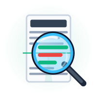

  
  <h1 align="center">SafeLens AI Health Guard</h1>
  

    <strong>Your personalized, intelligent scanner for food, skincare, medications, and menus.</strong>
  

  

    
    
    
    
  

 

## 🌟 Overview

**SafeLens AI** is a state-of-the-art, client-first health assistant that lives right in your browser. Whether you are scanning a confusing food ingredient label, checking skincare products for toxic chemicals, or verifying drug-to-drug interactions, SafeLens gives you instant, personalized health feedback.

By blending **on-device Machine Learning (OCR)**, a **Smart Heuristic Engine**, and **Cloud AI (Llama 3)**, SafeLens protects your health while respecting your privacy and API limits.

---

## 🚀 Key Features

* **📱 Live Camera Scanning:** Utilizes high-resolution 1080p camera streams directly from your mobile browser for crystal-clear label captures.
* **🩺 Personalized Profiles:** Set your medical conditions (e.g., Diabetes, Hypertension), allergies (Nuts, Dairy), and skin type. SafeLens adapts its warnings specifically to *your* biology.
* **🥗 Multi-Domain Intelligence:**
  * **Food Labels:** Detects hidden sugars, harmful preservatives, and artificial dyes.
  * **Skincare:** Flags comedogenic oils, harsh surfactants, and endocrine-disrupting chemicals (EDCs).
  * **Medications:** Analyzes drug combinations for dangerous interactions.
  * **Menu Decoder:** Breaks down restaurant menus to recommend clean, high-protein options and flag high-glycemic traps.

---

## 🧠 AI & ML Architecture

SafeLens AI utilizes a hybrid architecture, combining local edge computing with ultra-fast cloud AI to deliver perfect results:

### 1. Edge-Based Computer Vision (Tesseract.js)
Image processing and text extraction happen **100% locally on your device**. Using `Tesseract.js`, SafeLens applies high-contrast grayscale filters and extracts text via optical character recognition (OCR) without ever uploading your photos to a server.

### 2. Smart Heuristic NLP Engine (Offline)
To save API limits and provide sub-second responses, SafeLens uses an advanced **Heuristic Regex Engine**. Instead of relying on a bloated 10MB offline database, it uses smart pattern matching to identify chemical classes:
* `/-ose$/` or `/-itol$/` → Sugars & Alcohols
* `/-ate$/` or `/-ite$/` → Synthetic Preservatives
* `/paraben/` or `/phthalate/` → Cosmetic Toxins & EDCs

### 3. Deep AI Analysis (Groq API + Llama 3)
When the offline heuristic engine encounters highly ambiguous or complex ingredient lists, SafeLens seamlessly scales up to the cloud. It leverages the lightning-fast **Groq API** running the **Llama-3-70b** model to semantically analyze the text, ensuring no dangerous ingredient slips through the cracks.

---

## 🛠️ Tech Stack

* **Frontend:** React.js
* **Styling:** Tailwind CSS (Glassmorphism, custom micro-animations)
* **Computer Vision:** Tesseract.js (Client-side OCR)
* **LLM API:** Groq API (Llama 3 70B)
* **Deployment:** Vercel

---

## 💻 Getting Started

### Prerequisites
Make sure you have Node.js and npm installed.

### Installation
1. Clone the repository:
   \`\`\`bash
   git clone https://github.com/JKD-codes/SafeLens_AI.git
   \`\`\`
2. Navigate into the directory:
   \`\`\`bash
   cd SafeLens_AI
   \`\`\`
3. Install dependencies:
   \`\`\`bash
   npm install
   \`\`\`
4. Set up your Groq API Key:
   * Create a `.env` file in the root directory.
   * Add your key: `REACT_APP_GROQ_API_KEY=your_api_key_here`
5. Start the development server:
   \`\`\`bash
   npm start
   \`\`\`

---

## 🛡️ Privacy First
We believe your health data is yours. 
* 🚫 **No Image Uploads:** The camera stream is processed in your browser memory.
* 🚫 **No Databases:** Your medical profile and allergies are stored locally on your device.

---

  
Built with ❤️ for a healthier future.

